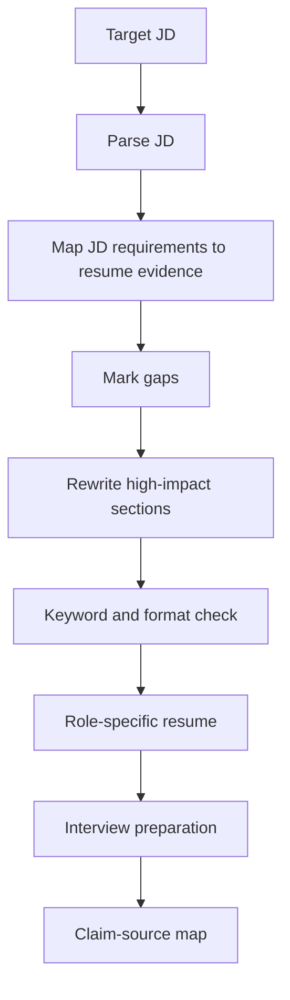

# Auto Adapted Resume

## Purpose

Auto Adapted Resume is a practical workflow for adapting a resume to a specific job description.

It does not start by making the resume sound more polished. It starts by asking a simpler question:

> Does this resume actually provide evidence for what the JD asks for?

## Core workflow



## Principles

1. Preserve the original resume structure unless role matching requires a change.
2. Optimize for JD alignment, not decorative wording.
3. Do not fabricate experience, metrics, employers, awards, or publications.
4. Ask for missing information before guessing.
5. Keep a claim-source map for important resume claims.
6. Rewrite the few sections that matter most: summary, skills, first projects, keywords, and result statements.

## Step 1: Parse the JD

Extract:

| Category | What to capture |
|---|---|
| Hard requirements | location, duration, education, tools, programming languages, seniority, industry requirements |
| Core tasks | what the candidate will actually do |
| Ability keywords | repeated skills or screening-sensitive terms |
| Scenario | business, research, product, engineering, or domain context |
| Quantitative expectations | scale, latency, accuracy, cost, quality, efficiency, metrics |
| Hidden preferences | ownership, documentation, fast iteration, cross-functional work, research taste |

## Step 2: Build the alignment table

Use a four-column table before rewriting.

| JD requirement | Resume evidence | Gap | Modification action |
|---|---|---|---|
| Requirement from the JD | Matching resume experience | Covered / Hidden / Vague / Missing | Move, rewrite, add context, ask user, or omit |

Gap labels:

- Covered
- Done but hidden
- Written too late
- Too vague
- Weak but bridgeable
- Missing
- Do not claim

## Step 3: Ask targeted questions

Ask only when the answer can materially improve the resume.

Examples:

- You list this skill. Where did you use it in a real project?
- The JD asks for this scenario. Do you have a similar project context?
- The resume lists actions. What was the result or value?
- The JD values collaboration. Who did you coordinate with, and what did you deliver?

If the user cannot answer, use conservative wording or omit the claim.

## Step 4: Rewrite with minimum change

Rewrite in this order:

1. Target title or one-line positioning
2. Profile summary
3. Skills order
4. First two projects or work experiences
5. Project bullets
6. Keywords
7. Result statements
8. Interview framing notes

## Step 5: Generate role-specific outputs

For each concrete role, create:

```text
role_package/
  tailored_resume.md
  jd_resume_alignment_table.md
  interview_prep.md
  claim_source_map.md
  manifest.json
```

## Resume file template

```markdown
# Candidate Name — Tailored Resume for Company / Role

## Target role

## One-line positioning

## Profile summary

## Skills matched to this JD

## Experience / Projects

## Keywords for screening

## What not to overclaim

## Gaps and how to handle them in interview

## Fill before sending

- Phone:
- Email:
- Location:
- Portfolio / GitHub:
- Available start date:
```

## Interview prep template

```markdown
# Interview Prep — Company / Role

## HR questions

## Technical basics

## Project-specific deep dives

## Weakness questions

## Prepared answers

## 30-minute review checklist
```

## Claim-source levels

| Level | Meaning | Use in final resume? |
|---|---|---|
| E1 | Directly supported by resume, repo, document, or user-provided evidence | Yes |
| E2 | Strongly inferred from several supported facts | Yes, conservative wording |
| E3 | User-confirmed | Yes |
| E4 | Plausible but unverified | No; ask or omit |
| E5 | Contradicted or overclaimed | No |

## Language scope

This open-source version is language-neutral by default. If you want a narrower version, define an allowed language list and reject unrelated language tailoring.

## Quality checklist

- [ ] A JD-resume alignment table exists before rewriting.
- [ ] Important claims have evidence levels.
- [ ] The resume does not invent metrics or experience.
- [ ] The first screen of the resume matches the role.
- [ ] The skill order follows the JD.
- [ ] The strongest relevant experience appears early.
- [ ] Weak or missing requirements are handled honestly.
- [ ] Interview prep is generated from the tailored resume.
